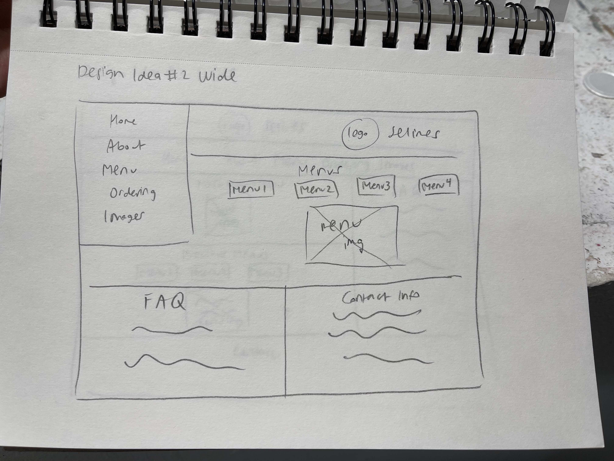

# Group Project: Design Journey

**For each milestone, complete only the sections that are labeled with that milestone.** Refine all sections before the final submission.

You are graded on your design process. If you later need to update your plan, **do not delete the original plan, leave it in place and append your new plan _below_ the original.** Then explain why you are changing your plan. Any time you update your plan, you're documenting your design process!

**Replace ALL _TODOs_ with your work.** (There should be no TODOs in the final submission.)

Be clear and concise in your writing. Bullets points are encouraged.

Place all design journey images inside the "design-plan" folder and then link them in Markdown so that they are visible in Markdown Preview.

**Everything, including images, must be visible in _Markdown: Open Preview_.** If it's not visible in the Markdown preview, then we can't grade it. We also can't give you partial credit either. **Please make sure your design journey should is easy to read for the grader;** in Markdown preview the question _and_ answer should have a blank line between them.


## Client (Milestone 1)

### Client Description (Milestone 1)
> Tell us about your client. Who is your client?
> Explain why your client meets the client rules in the project requirements.

- Delesa McGruder
- 20 years old
- Nolan School of Hotel Adminisrtation (what's her major?)
- She has a food service business, Selines, all about "bringing the taste of Soul Food to Ithaca"
- Since there is no website for Selines, she operates off of her busniess Instagram.
- She meets the client rules because she wants to create a site for her local business and is not one of our members


### Client Questionnaire (Milestone 1)
> Develop a client questionnaire to learn more about your client and their goals.
> You may use the questionnaire below, you may modify the questionnaire below, or you may create your own.

1. Describe your organization and its purpose.

   Selines is food service business aiming to provide the "taste of home" (home-cooked meals) specifically to Ithaca residents. The type of food prepared is soul food and the menu changes constantly.


2. What makes your organization and its services special or unique?
   She cooks what people like to eat, so her meals go beyond soul. It provides an experience of nostalgia from a good home cooked meal, which is incredibly important considering all of her customers are away from home and missing this form of comfort.

   Selines is a "fast casual pop-up" meaning that there is no in-person restaurant constantly open. Rather, Delesa's business follows a pop up shop type of experience. Around every few weeks, she sells her ready-to-go plates.


3. Why are you looking for a new website or updating your existing site?
    At the moment, Delesa uses instagram for all of her orders. While she is ok with that, she does not have a website that gives a detailed overview of her business.


4. Who do you want to visit your site? Who do you believe is your website's intended audience?
    Primarily students and organizations (for catering) on Cornell's campus. They are who she comes into contact with the most in Ithaca.


5. When visiting your site, what actions do you want your visitors to take?
    - Look at the menu for what's being sold and pricing details
    - How to order
    - About the business and the business owner
    - Pick up location for the food and delivery
    - Any links to her social media
    - Photos of the food she makes


6. What are your goals for this site?
    - Accessible information and content for the clientele
    - Easy to navigate
    - They want a simple site
      - place the order and recieve the order in a simple way (or at least link to a place where they can)
    - They want muliple orders on one form
    - Rotational Menu (the menu is not a set menu as what she cooks changes which each pop-up)


7. Is there a "feel" that you want for your site? Are there colors or imagery that you have in mind?
    - Pink Logo with White Lettering
    - Base colors Pink, White, Black, and Gray (to match the color of her logo)
    - Sleek look, elegant, simple
      - Does not want the client to be distracted by anything except the food.
      - Cursive font, serif font
    - "Neat and homely"


8. What are your three favorite competitors or similar organizations' websites? Why?
   - Doordash and Uber Eats (simply because she uses it a lot and is familiar with its interface)
   - Yang's Kitchen because of it's simple and professional looking website that is very easy to use and also aesthetically pleasing
   - Old Lady Gang (has a classy format she enjoys and includes similar content to the ones she wants on her website)


### First Client Meeting Minutes/Notes (Milestone 1)
> Include your notes/minutes from your first meeting with your client.
Meeting Length: 32 mins

Notes:

- Delesa is concerned mostly with having somewhere to take her orders
- She wants her site to have some biographical information about herself
- Who is she? What is Selienes? What is Selienes purpose?


### Client Website (Milestone 1)
> Tell us about the website that your client wants.
> Tell us the purpose of the website and what it is all about.
> Note: **If you are redesigning an existing website, give us the current URL and some screenshots of the current site.** (FireFox makes it easy to take a full screenshot of a page from the context menu (right click).)
> If you are redesigning an existing site, tell us how you plan to update the site significantly that meets the project's requirements.

- The client requires a website to display her services to visitors effectively. The website should feature a section detailing Selena's objectives and highlighting her unique qualities in comparison to competitors. The primary purpose of the website we intend to build is to provide a platform for people to engage with the business, learn about Selena's services, and understand how they can support her business through purchases or collaborations.

### Client Goals (Milestone 1)
> Identify your client's goals for the website.
> What kind of website do they want? What are their goals for the site?
> There is no required number of goals. You need as many goals as necessary to reflect your client's desires.

- Goal #1: The client wants biographic information about herself and the business (Selienes) she owns. She wants to include who she is, what Selienes is, and its purpose.
- Goal #2: The client wants to include a way in which she is able to receive orders from her customers (Preferably introducing a link to a form where customers can submit their orders) and introduce to her customers about the order process.
- Goal #3: Introduce menu and its pricing
- Goal #4: Include information about pickup location and about delivery
- Goal #5: Links to her Selienes' social media
- Goal #6: Include images of Selienes' food
- Overall, the client would want a simple website where the customers can navigate easily. As in design, the client wants something elegant, with the color scheme that well matches the business' logo.


### Client Website Scope (Milestone 1)
> We want your project to be successful! It needs to be ambitious, but not too large.
> A good rule-of-thumb is that you should have about 1 content-full page for each team member.
> Explain why the website you will create for your client isn't too small and isn't too big.
> Explain why you think it's the right size for this project.

- For our client's website, we would have about 5 pages of full content that meets our client's goals, with both images and text in each. The website that we create for our client is not too big because it does not have an overwelming number of pages with excessive content that would be hard for the audience to navigate. The web page still will have enough content evenly spaced out on each page for the overall website to be usable for the audience. Having around this number of pages will be the right size for the project because it will be enough to put all the content that the client wants for their website, while not being too empty or overwhelming. This amount of content will also be ambitious, yet not excessively overwhelming for our group.

## Plan/Schedule (Milestone 1)
> Make a plan of when you will complete all parts of this assignment.
> This plan is for your team. There is no required format. Format it so that it works for you!
> Your plan should include when you will interview users and analyze their goals.
> Your plan should also include how and when you will assemble/create the sit's content.
> **Tip:** Your team should plan to work ahead. This project really isn't feasible to complete the night before a deadline.

Weekly Schedule (Wed-Wed):

- Team meeting (Fri-Sun)
  - We discuss what we are going to do for the milestone
    - If we cannot meet over zoom, we'll message in the groupchat and catch up any member that missed it on what was discussed

- Client Meeting (Fri-Sun, but after the team meeting)
  - We meet with the client and discuss feedback from the previous milestone
    - The client is free to meet typically Sunday, 3-5 pm (over Zoom) or Monday after 6:30 (in-person)

- Work Due
  - All work for the milestone will be due latest Tuesday 12:00 pm

- General Deadline/Timeline to Follow:
  - 10/25 noon: finished with milestone 1
  - 10/27- 11/3- Finish our individual interviews, analyze goals from interviews, content planning, and website examples for milestone 2
  - 11/3- 11/10- finish information architecture and visual themes, and code HTML for milestone 2
  - 11/10- 11/14- interactivity rationale and plan, client feedback finish, code the general CSS and submit milestone 2
  - 11/17- 11/21- finish designs for the website, add all Javascript and CSS styling for final submission
  - 11/21- 11/27- all user testing for final submission
  - 11/28- final rationales and submit project

- Final Edits:
  - From Tuesday 12:00 pm to the milestone submission time of Wednesday 11:59 pm, the milestone will go through final edits


## Understanding Users (Milestone 2)

**Make the case for your decisions using concepts from class, as well as other design principles, theories, examples, and cases from outside of class.**

You can use bullet points and lists, or full paragraphs, or a combo, whichever is appropriate. The writing should be solid draft quality, but it doesn't have to be fancy.


### User Interview Questions (Milestone 2)
> Plan the user interview which you'll use to identify the goals of your site's audience.
> You may use the interview template below and revise it as much as you desire.

**User Interview Briefing & Consent:** "Hi, I am a student at Cornell University. I'm currently taking a class on web design and for a project, I am designing the website for Delesa McCruter. I'm trying to learn more about the people that might use this site. May I ask you a few questions? It will take about 10 minutes. You are free to quit at any time."

1. Please tell me a bit about yourself. You may omit any personal or private information.

2. When you go on a restaurant website, what are you looking for?

3. What page of the restaurant website do you think is the most important out of all?

4. What essential feature do you often not find on a restaurant's website?

...

n. What haven't I asked you today that you think would be valuable for me to know?

**After the interview:** "This was really helpful. Thank you so much for agreeing to speak with me today. Have a great day!"


### Interview Notes (Milestone 2)
> Interview at least 1 person for every member of your team from your audience.
> Take notes and include those notes here. Make sure to include a brief description of each interviewee.
> **Copy the interview questions above into each interviewee section below.**
> Take notes for each participant **inline** with the questions.

**Interviewee 1:**

1. Please tell me a bit about yourself. You may omit any personal or private information.
Wesley, Sophomore in COE, MechE, NSBE Board, Cornell Electric Vehicles member, avid soul food enjoyer.

2. When you go on a resturant website, what are you looking for?
How much it costs, hours its open, deals or coupons, and the menu.

3. What page of the restaurant website do you think is the most important out of all?
Menu page; can see if they sell anything he's craving currently and the price of each item.

4. What essential feature do you often not find on a restaurant's website?
Special events, or discounts/party packages are hidden behind other aspects of the website usually and have hard time finding them.


**Interviewee 2:**

1. Please tell me a bit about yourself. You may omit any personal or private information.
Sophomore in AAP, loves to dine outside and loves food.

2. When you go on a restaurant website, what are you looking for?
Specific explanations on menu, pricing, ordering process.

3. What page of the restaurant website do you think is the most important out of all?
Home page because it shows the brand identity. As an fine arts student, the brand identity and the mood of the restaurant means a lot to me.

4. What essential feature do you often not find on a restaurant's website?
I'd like to know about busy hours which many of the restaurants don't have listed on their website.


**Interviewee 3:**

1. Please tell me a bit about yourself. You may omit any personal or private information.
Jennifer, Biology & Society major in Ithaca, senior, misses home-cooked meals.

2. When you go on a restaurant website, what are you looking for?
The menu, pricing, how to make reservations if they're needed, and pictures of the food.

3. What page of the restaurant website do you think is the most important out of all?
The page with the menu because where they dine is based on what the restaurant offers. They do not want to be blindsided by the menu options and arrive at the restaurant with no foods they can enjoy.

4. What essential feature do you often not find on a restaurant's website?
I wish there was an option where I can place my order prior to arriving at the restaurant like DoorDash or UberEats. Sometimes, I don't feel like talking to the waitstaff.

**Interviewee 4:**

1. Please tell me a bit about yourself. You may omit any personal or private information.
Carla, Professor at Cornell University, enjoys homestyle meals and trying new foods

2. When you go on a restaurant website, what are you looking for?
Looking to see what type of cuisine is offered and how accessible it is to go pick up; also checks location to see if it is within her walking/biking distance because she enjoys trying to be active; also background information because she wants to support local businesses

3. What page of the restaurant website do you think is the most important out of all?
Menu and instructions on how to order/get the food so that it is clear, since some places do not specify directions and she finds it difficult to retreive and support the business

4. What essential feature do you often not find on a restaurant's website?
She wants to know the ordering process and what is the best form of payment since some restaurants have conflicts with online payments or prefer cash payments but never specify.


**Interviewee 5:**

1.Interviewer: Please tell me a bit about yourself. You may omit any personal or private information.

Interviewee: I'm Joe currently a Junior, majoring in Animal Science, and my enthusiasm for exploring diverse culinary experiences fuels my love for dining out. I'm genuinely passionate about discovering new flavors and enjoying good food.

2.Interviewer: When you visit a restaurant website, what are you looking for?

Interviewee: When I explore a restaurant's website, my focus is on finding specific details about the menu, pricing information, and a seamless ordering process. Having clear and concise information in these areas helps me decide whether to dine in or place an order.

3.Interviewer: Which page of the restaurant website do you think is the most crucial?

Interviewee: In my view, the home page is the most crucial on a restaurant's website. As someone with a background in fine arts, the brand identity and the overall ambiance conveyed on the home page are paramount. It sets the stage and provides a glimpse into the dining experience the restaurant aims to deliver.

4.Interviewer: What essential feature do you often not find on a restaurant's website?

Interviewee: One crucial feature that I frequently find missing on restaurant websites is information about peak hours. Knowing when a restaurant tends to be busiest would be valuable for planning visits or placing orders, allowing customers to avoid long wait times. Unfortunately, this information is often overlooked or not provided on many restaurant websites.


### Goals (Milestone 2)
> Analyze your audience's goals from your notes above.
> List each goal below. There is no specific number of goals required for this, but you need enough to do the job (Hint: It's more than 1 and probably more than 2).

Goal 1: Meals and Pricing

See what type of meals are being sold from the business and what the prices are like

- **Design Ideas and Choices** _How will you meet those goals in your design?_
  - We would meet these goals by including a menu with all the descriptions of the dishes and pricing details

- **Rationale & Additional Notes** _Justify your decisions; additional notes._
  - The menu with the prices can help the users see how much all the dishes and what dishes are being sold to see if it meets their criteria

Goal 2: Placing and Receiving Orders

Understand and figure out how/when to order and receive their food once ordering from the business

- **Design Ideas and Choices** _How will you meet those goals in your design?_
  - We would meet this goal by including detailed instructions on how to order their food and information about picking-up the food as well as the an FAQ section of commonly asked questions so all other questions regarding ordering can be easily accessible.
- **Rationale & Additional Notes** _Justify your decisions; additional notes._
  - The instructions of how to order will provide the audience detailed information about placing their orders and the pick-up directions and FAQ section will give the user access to any information they should know prior and after placing their orders so they can be satisfied when receiving their food.

Goal 3: Business and Business Owner Biography

Get a general understanding of the business to figure out its legitimacy and quality

- We can include any information about the business owner and descriptions of this business as well as all the past dishes she has made for it so the users can know what the business actually is.

- The descriptions about the business and the owner can help the user find information about how the business is like and credentials of the business owner. The photos of the past dishes she's made will allow the user to see the quality of the food she makes.

### Audience (Milestone 2)
> Briefly explain your site's audience.
> Be specific and justify why this audience is a **cohesive** group with regard to your website.

Our website's audience are primarily Ithaca area residents wanting to order home-cooked meals with rotating menus that they can locally pick up and enjoy whenever available. This audience is a cohesive group because they are all individuals living within the Ithaca region and are available to easily order and pick-up the food they order and also comfortable with the locations that the business owner will offer the meals in Ithaca as a pop-up since they are familiar with the region.


## Website Design Exploration (Milestone 2)
Identify three websites (preferably static websites) that exist today on the web to draw inspiration from. Please select websites that are similar to the website you wish to create.

Include two screenshots of the home page for each site: narrow and wide.

**We'll refer to these are your "example websites."**

1. <[Diner NYC](https://www.dinernyc.com/menus/#dinner)>

    

    

2. <[Reign Toronto](https://www.reigntoronto.ca/)>

    

    

3. <[Miss Lily's](https://www.misslilys.com/)>

    

    


### Example Website 1 Review (Milestone 2)
> Review the website you identified above. (1 paragraph)
> In your review, include a discussion common design patterns and interactivity in the site.
>
 The diner website has an simple design that welcomes users with a captivating full width image on the homepage. To make navigation easy there's a bar at the bottom that provides access to important information like opening hours, location and menus. The menu page follows a white color scheme, reminiscent of printed menus ensuring it's easy to read and familiar to browse through. While the site is responsive on devices for usability it maintains a straightforward approach without interactive features, like hover effects that could enhance user engagement. This design choice focuses on functionality and ease of navigation while giving a touch to the timeless of traditional diners.T he page once loaded in has a popup on the top similar to a cookies banner with tidbits of information about new things coming to the diner.


### Example Website 2 Review (Milestone 2)
> Review the website you identified above. (1 paragraph)
> In your review, include a discussion common design patterns and interactivity in the site.
>

The website for the Reign restaurant showcasing images that transport you to the actual place. The menu is straightforward and user friendly, on devices thanks to the hamburger menu button. The homepage features a slideshow of captivating photos that showcase the restaurants essence adding a touch. The combination of gold colors exudes sophistication and perfectly complements the upscale atmosphere they aim to achieve. Whether accessed from any device the website effortlessly assists visitors in finding their desired information, such, as the menu or table reservations while also providing a glimpse into the dining experience awaiting them. The page once loaded has a pop up modal informing of thepreordre dates and the upcoming change to the menu.


### Example Website 3 Review (Milestone 2)
> Review the website you identified above. (1 paragraph)
> In your review, include a discussion common design patterns and interactivity in the site.

Miss Lilys website has an lively appearance that perfectly complements the restaurants energetic atmosphere. On the homepage you'll be greeted with an colorful photograph that immediately grabs your attention showcasing a scene full of excitement and liveliness. The menu is conveniently located at the top of the page ensuring navigation throughout the site. Every aspect of the website is designed to be user friendly allowing you to effortlessly access features such as browsing through the menu or locating their physical address. The only visible interactivity is the hamburger button on the narrow screen.


## Content Planning (Milestone 2)

Plan your site's content.

### Your Site's Planned Content (Milestone 2)
> List **all** the content you plan to include your website.
> You should list all types of content you planned to include (i.e. text, photos, images, etc.)
> Briefly summarize the content; do not include the content here.

- Biographical information about the business and its owner
- Previous and current menus
  - All food and drink items
  - Pricing
- Description of what the business is
- Images
  - The business owner
  - The food
- Information on how to order
- Link to the google form to place orders
- Contact Information
  - Links to the social media page for business updates
  - Emails
  - Phone number(if needed)
- Frequently Asked Questions
  - information on where to pick up order and customizations

### Content Justification (Milestone 2)
> Explain (about a paragraph) why this content is the right content for your site's audience and how the content addresses their goals.

The goals of the audience involves finding out the different meal options and pricing, placing and recieving orders, and information regarding the mission statement of the business and the biographical information about the business owner. The content involving all prior and current menus, including pricing, is meant to address the goal of finding the different meal options and pricing. Images also aid in providing visuals for the site audience to help them make a decision about what they want to eat. There is also a link the order placing/receiving form, that addresses the audience's second goal of placing and receving orders. Included in that goal is contact information to get in touch with the business in care something goes wrong(or right) and also an FAQ section to answer any common questions they might have before placing their orders. Finally, we plan to incroporate a section dedicated to the biographical infromation about the business owner, Delesa and her mission in opening Seline's. The audience gets a good understanding of what she and busniness are all about.


## Information Architecture (Milestone 2)

### Content Organization (Milestone 2)
> Document your **iterations** of card sorting here. You must have at least 2 iterations of card sorting.
> Include photographic evidence of each iteration of card sorting **and** description of your thought process for each iteration.
> Please physically sort cards; please don't try and do this digitally.


The first iteration has five groupings. The biographical details of the business and the business owner alongside the image of the chef are grouped together so all the information about the business and how it started can be in one grouping How to order and the link to google forms for ordering can be found in a separate group so that the user can order easily when they are ready. Current and past menu are in another group so the audience can see the prices and the menus of all the meals together to see if the food caters to their needs and the price fits their standards. The business description and the contact information is in another grouping so the audience can easily get a brief understanding of what the business is and contact them if necessary. Lastly, the food images and FAQ are grouped together so the audience can see all the past credentials and visual images of the foods and find answers to any questions they would have after looking at it.


With the second card sorting, the content has been grouped into five categories again. This time, the information about the business and the FAQ section is grouped together so the audience can see this pagge when they want to better understand the business. The chef and brief business description, as well as the chef image is grouped so the audience can get an overall understanding of the business and their owner. The current menu is grouped with an order form so the audience can look at it before clicking on the link to order their food. The order details and contact information is in another group so all the instructions and answers to common questions are in one place. Lastly, the previous menus and food images are in another group so the audience can access the past examples and credentials of the foods and their quality in one spot.

### Final Content Organization (Milestone 2)
> Which iteration of card sorting will you use for your website?

We plan to use the first card sorting because it best organizes and addresses the audience's goals.

> Explain how the final organization of content is appropriate for your site's audiences.

The final organization is appropriate because it spaces out the content that addresses their goals into five even categories and does not have one group with overwhelming amount of information. They are able to see meals and pricing, information about ordering, and general descriptions of the business is these different categories.

- New - Changes
TThe contact details will now be on the footer of every page and the FAQ will be a sidebar on every page so that the audience can have quick access to these content on every page they are at. In addition, there will be some photos of the food with the business description as well as so that they can quickly see this as an overview.


### Navigation (Milestone 2)
> Please list the pages you will include in your website's navigation.

- Home
- About
- Menu
- Ordering
- Images

> Explain why the names of these pages make sense for your site's audience.

- Home: This page will introduce the business and show some images of the current menu to draw the audience in.
- About: This page will be called 'About' because it would contain biographic information about our client, herself, and also a business introduction of Selines (What Selienes is, and its goals/purpose and a few pictures of the type of meals sold).
- Menu: This page will be called 'Menu' because it will introduce all the menus that are available at her store and pricing for each as well as access to the previous menus.
- Ordering: This page will be called 'Ordering' because it will contain explanation of the order process, link to the Ordering Google Form, and how the order will be processed. It would be divided in chronological order of the ordering and purchasing process of our client's customers.
- Images: This page will be called 'Images' because it will contain food images in a gallery format for our client's customers who are wondering what the food she is selling looks like.

## Visual Theme (Milestone 2)
> Discuss several (more than two) ideas about styling your site's theme. Explain why the theme ideas are appropriate for your target audiences. Note the theme you selected for your site and why it's appropriate for the audience and their goals.


Idea 1: Playful, welcoming theme

- Rationale: Because the audience of the website are mostly college students or young adults in Ithaca who are looking for a place to eat, the website would have a joyful mood. In order to bring such mood into our website, our website would consist of bright colors like bright red/orange/green/yellow, rounded fonts, rounded borders/shapes. As in imagery, we will add a lot of cute and playfuil icons and emojis to make such mood possible. Making the website look positive and bright will make the audience feel welcomed and more attracted to visiting and tyring food from the business.

Idea 2: Pink and white theme with elegant style

- Rationale: Our client wants the website to have a color theme of pink and white in order to match the logo of her business. Adding to what our client requested with the color themes, her logo is created with an elegant style font with a lot of curves. In order to keep the website's professionality, the shapes that are included in our website wouldn't have rounded corners but rather straight corners. As in imagery, again, we would use pink or neutral colored icons in order to match the theme. Moreover, since our client would like the website's theme to match her logo's style, making the website with a similar style will make the website look cohesive, while meeting the needs of our client.

Idea 3: Professional Black and White theme

- Rationale: Because the website is for a business, the website should look professional. The overall design of the website would be simplicity. Therefore, the color theme of the website would be simply black and white. The font of the website would also be using professional fonts like times new roman. Moreover, in order to keep the website's professionality, the shapes that are included in our website wouldn't have rounded corners but rather straight and sharp corners. As in imagery, we would use monochromatic and simple icons and emojis to bring professionalistic mood into our website. Making the overall style of the website simple would meet the needs of the audience because it allows easily reading and navigation.

Final Theme: Idea 2 would be our final theme because it was meets all the needs of our Client and our audience. She loves the color theme and having elegance to the website in order to match her business' logo. Although we would choose the level of elegance to not be too strong so that it does not affect user experience (make the users have hard time reading, navigate, etc.). This theme would be the best to match the business and also show the website as a professional, easily accessible, and organized website that the audience can trust and feel is legit.


## Design (Milestone 2)

Document your site's layout.

## Interactivity Brainstorm (Milestone 2)
> Using the audience goals you identified, brainstorm possible options for interactivity to enhance the functionality of the site while also assisting the audience with their goals.
> Briefly explain idea each idea and provide a brief rationale for how the interactivity enhances the site's functionality for the audience.
> Note: You may find it easier to sketch for brainstorming. That's fine too. Do whatever you need to do to explore your ideas.

- Menu Gallery by Different Buttons
  Simplifies the menu and allows the user to choose the menus they want to look at to see the dishes offered instead of all at once.

- Seasonal Pop-Up on Initial Load
  Upon visiting the website a pop up immediately appears to showcase specials or promotions capturing the users attention and directing them towards limited time offers.

- Hamburger Menu
  Concise menu design maintains an organized appearance for the website. It caters to narrow screens more commonly used by mobile devices. It expands to reveal options without occupying screen space.

- Gallery Carousel
  Rotating gallery of images such as dishes or the restaurants ambiance we incorporate a visual component. This enables users to easily explore the catering offerings.


### Layout Exploration (Milestone 2)
> Iterate on your site's design through sketching.
> Sketch both the narrow and wide versions of the site.
> Here you are just exploring your layout ideas. You don't need to sketch every page.
> Include some of your interactivity ideas in your sketches.
> Provide an explanation for each sketch explaining the idea and the design patterns you are leveraging.

Design Idea #1

For this narrow design, we implemented the hamburger menu in the right corner with the logo and title since it’s a common design pattern and aligned the navigation bar to the right so that it is closer to the user’s cursor after clicking the hamburger button. We split the content in sections and included a gallery with buttons of different menus so that the audience can access just the one they need instead of having to scroll. The headers are centered to draw the audience in.


For the wide design, we put the navigation in the same row as the logo and title so that it saves space and looks concise. The nav bar is on the right side so that the design is similar to the narrow one. We made a sidebar with the FAQ and a footer with the Contact Information so that the audience can easily access those information when they are looking for it. We also added a flex box between the current and previous menus so the user can simultaneously look at it on a wide screen and implemented the same gallery interactivity for the past menus so the audience would only click the one they want to see instead of having to constantly scroll.

Design Idea #2

For this narrow design, we implemented the hamburger menu on the left side as a pop up since left aligned is the easiest to read and made the hamburger menu on the left side as well. For the other content, instead of separating the current and previous menus into different sections, we added it as a buttons in a row so that the audience can just click on the one they want to see and only that one will pop up. The FAQ and Contact Info is just written below it with left-aligned text.


For the wide version, the navigation bar is in the same pop up format in a column like the narrow version. The logo and title is in a flex box on the right side so that it does not overlap with the navigation bar. The same idea of all the menus being in one section with a row of buttons is implemented on the page. Clicking the button will open up only the menu the user wants and it prevents users from having to constantly scroll. For the FAQ and the Contact information, we added a flex box to have them in a row at the bottom instead of as a footer and sidebar so that the gallery of menu/buttons can take up the full screen.


Design Idea #3

For this narrow design, we created a flex box with the logo, title, and hamburger menu so they can all be neatly in a row at the top of the page. We made the navigation bar aligned left as a common design pattern from other websites and stacked the current menu as a section on top of the past menus. The past menus are implemented as buttons in a row so that they can just access those quickly for reference. The FAQ and Contact Information is stacked below it in their own sections. The menus and buttons are center aligned to draw the audience in, but the text is left-aligned so it is easier to read.


For the wide version, the logo and title are in a row and the navigation bar is centered in a flex box below it. It’s center aligned to draw the audience in and in a separate row from the heading so that it looks visually appealing. The FAQ and Contact Information are in a sidebar on the right and a footer so that there are neat sections visually in the design and because they are common designs seen in other websites. The current menu is separate in a section from the previous menus, which are shown as different buttons in a flex row where when only the one that is clicked by the user is show.

### Final Design (Milestone 2)
> Include the final sketches for each of your pages.
> **Include your final interactivity in your sketches.** Include annotations to explain what happens when the user takes an action with your interactivity.
> The sketches must include enough detail that another 1300 student could implement them.
> Please provide an explanation for each sketch.

**Narrow Design:**


For the home page, I implemented the same heading design of the logo and title in one row with the hamburger button and the navigation bar as a column below it that only shows up when the hamburger button is clicked. I added a section for the introduction and a brief description of the business and created new sections for the main course and dessert with images being centered to be visually appealing instead of in flex boxes. The FAQ and Contact Information are below it in their own sections like the design #3.


Edit: We added a button to the home page so that there can be a pop up modal to show the seasonal menu when the user first clicks the page. In addition, we also made the FAQ questions and answers accordions where the answers are only shown when the question is clicked and hidden again when clicked again to show only the answers that the user wants to see.


Edit: We included a pop up modal so this shows how it would look on a narrow screen, where the background would appear transparent and the modal would be on top of the website. The close button on the corner would hide this modal.


The header is the same as the home page with the same hamburger menu so that the design is kept the same on all the pages. The About the Business section is placed under with an image center aligned so that it is best fit for the narrow screen and the same format is kept for the About the Chef section (with an image under centered after the written content). The FAQ and Contact Information is placed under it the same way as the home page.


Edit: We switched the order of the images under about the business so they show on top of the written content and also added one extra image.


For the menu page, I kept the same narrow screen design from Idea #3 and implemented the gallery/buttons of the previous menus as an interactivity design.


For the ordering page, the header and hamburger menu design is kept the same as the others. The Ordering Directions are listed under it and all the content is stacked vertically. The FAQ and Contact Information is placed at the bottom like the other pages.


For this page, the header and hamburger design is kept the same as others. The FAQ and Contact Information is also in the same layout. The images of the food are stacked on top of each other and centered to catch the audience's attention

**Wide Design:**


For the wide design, I added a flex box for the header and a centered flex box of the navigation bar below it (design #3) and created the layout of main content and sidebar of the FAQ on the right and a footer of the Contact Information on the bottom. Within the main content, I implemented a flex box so the images in the main course are in a row and did the same thing for the dessert section to best utilize the space of the wide screen.


Edit: We added a button to the home page here to show the seasonal pop up menu as well. We implemented the same accordion as the narrow screen for the FAQ section.


Edit: We included a pop up modal so this shows how it would look on a wide screen, where the background would appear transparent and the modal would be on top of the website. The close button on the corner would hide this modal.


The header and navigation for the wide screen is the same as the home page so that everything is cohesive. The same layout of the sidebar and footer is kept the same. In both of the About the Business section and About the Chef section, the image and written content are in a flex box so they are placed in a row to best utilize the wide screen and so that the design is kept the same on the page to reduce clutter.


I kept the same wide screen design from Idea #3 and implemented the gallery/buttons interactivity and added flex boxes for the heading, navigation bar, and the menu images.


Edit: We added another flexbox so that the previous menus and recent menus are next to one another in the wide screen to utilize the width of the screen and make the user scroll less.


For the wide screen version, the header, navigation bar, and the sidebar and footer layout are placed the same as the other page. The directions are placed in the main content box with no flex boxes since the main section is only the directions and nothing else.


Like the other pages, the header, navigation bar, sidebar, and footer layout are placed in the same way. However, the images are in rows of two with flexboxes in each row so that two images are in a row and take up the wide screen and use that space most effectively.


Final Edit Note: The accordion interactivity is implemented for all the pages in both narrow and wide screen that have an FAQ section (so excluding the Menu page)

### Design Rationale (Milestone 2)
> Explain why your design is appropriate for your audience.
> Specifically, why does your content organization, navigation, and site design/layout meet the goals of your users?
> How did you employ **design patterns** to improve the familiarity of the site for your audience?

This design is appropriate for our audience because it allows them to meet their goals and find all the content that they need in a neat, organized, easy-to-navigate website. The content organization categorizes the different content to help the audience meet their goals and find the answers they need and the content that are grouped together are all related to one another so that the audience does not need to search through the entire website to find the informationt they need. The navigation names are easily identifiable and help to answer any questions that the audience would have and want to find, since they are related to the content that are in the pages.

The layout also meets their goals since, the sidebar on the right with the FAQ is included on each page so that any questions that are unanswered from the different pages are quickly accessible for the audience to look through. It is located on the right since most websites utilize this design and would improve the familiarity of the website for the audience. The footer with the contact information is also available on every page so that the audience would have access to it after reading the content on any page they look at, rather than having to look at a separate page in the website. Also, many websites have their contacts as a footer, so the user is already familiar with the design. The same common layout of a sidebar with the same content and footer with the contact information is utilized on every page to keep the design consistent and also because this is a design that users are familar with already and would be comfortable accessing.

## Interactivity Rationale (Milestone 2)
> Describe the purpose of your proposed interactivity.
> Provide a brief rationale explaining how your proposed interactivity addresses the goals of your site's audience and enhances their user experience.
>
 The menu gallery simplifies browsing by helping users easily find meals and view only the menu that they want to look at without having to surf through a long list of other menus as well. The hamburger menu provides a navigation system that is clutter free, which is especially beneficial for mobile users ensuring that information is easily accessible without overwhelming them. Our interactivity designs cater to our audience's desire for convenience, efficiency, and engagement when they are looking for the content that they specifically desire in a visually appeasing way while significantly enhancing their experience on our website.

 Edit: The seasonal pop up modal allows the user to see the immediate popular menu that is offered for a limited time on the home page. We made it with a button instead of it as a pop-up on load because having it constantly show up every time the user clicks the home page would become annoying. We also added an accordion for the FAQ questions so that the users can just click to see the answers to the questions they want and not have to read through answers to other questions.

## Interactivity Plan (Milestone 2)
> Now that you've designed your interactivity for your site, you need to plan how you will implement it.
> Describe how you will implement the interactivity. This should be a complete plan that another 1300 student could use to implement the interactivity.
> You should list the HTML elements, CSS classes, events, pseudocode, and the initial state.

Hamburger Menu Planning


**Hamburger menu pseudocode:**

Pseudocode to show/hide (toggle) the navigation menu (narrow screens):

*Uses Toggle Snippet and On-Load Event*

```
when #hamburgerbutton is clicked once:
    remove .hidden to #navigationmenu

when #hamburgerbutton is clicked again:
    add .hidden to #navigationmenu
```

Pseudocode to hide the hamburger button and show the navigation bar when the window is resized too wide:

*Uses On-Window-Resize Snippet and On-Load Event*

```
when screen-width is greater than 1000 px:
    add .hidden to #hamburgerbutton
    remove .hidden to #navigationmenu
```

Pseudocode to show the hamburger button and hide the navigation menu when the window is resized too narrow:

```
when screen-width is less than or equal to 1000px:
    add .hidden to #hamburgerbutton
    remove .hidden to #hamburger-button
```


Menu Gallery Planning


**Menu pseudocode:**

Initial State: (all images hidden)

On-Click Event:

```
  when #menu-button-1 is clicked:
    add .hidden to .menu-image
    remove .hidden to #image1

  when #menu-button-2 is clicked:
    add .hidden to .menu-image
    remove .hidden to #image2

  when #menu-button-3 is clicked:
    add .hidden to .menu-image
    remove .hidden to #image3
```

Edit: Pop-Up Modal Planning


**Modal pseudocode:**

Initial State: (modal hidden)

On-Click Event:

```
(Makes Modal Show)
  when #specialsbutton is clicked:
    remove .hidden to #seasonalPopup

(Hides Modal)
  when #close-popup is clicked:
    add .hidden to #seasonalPopup
```

Edit: Accordion Planning


Initial State: (only questions show and answers are hidden)

On-Click Event:

```
when .faq-question is clicked,
  remove .accessible-hidden to #answer (answer that correspons to the question)

when .faq-question is clicked again,
  add .accessible-hidden to #answer (answer that correspons to the question)

```

## Client Feedback & Minutes (Milestone 2)
> You should meet with your client again to obtain feedback on your design.
> Provide a summary of the client's feedback and your meeting's minutes.

The client is very pleased with the progress we've made thus far. At the start of the meeting, the client was informed that this was a draft site, so they were not alarmed by the implementation. They liked the thematic design choice of pink, white, and gray that is similar to their logo. Also, they appreciate the layout of the pages. She says, having a FAQ section on each page is very beneficial to the users. Moving forwards they would like the navigation bar to fill up much of the entire width of the page since there are a lot of pages on the site. And would like if we incorporated more color-pink and such-into the site. She's going to let us have full regin over the interactivity, but she was pleased with what we have so far. Finally, she said we seem to be good shape in regards to making a site that is functional and visually appealing.

~30 minutes

## User Testing (Final Submission)

**Conduct user testing with a minimum of 1 participant for every member of your team.**

### User Testing Tasks (Final Submission)
> Plan out your user testing tasks before doing your user testing.
> These must be actual user testing tasks.
> **Tasks are not questions!**

1. Find out if the user was able to navigate through the website/find information they were looking for easily.
   1. Find the most recent menu
   2. Find the instructions to place an order to Seline's
   3. Find the phone number for Seline's
   4. Find information about the chef
   5. Find out how to pick up and order from Seline's

2. Evaluate the accessibility of the website's information on smaller device.
   1. Using your iPhone, find an image of a previous meal sold.
   2. Click on any of the previous menus button.
   3. Click on any of the FAQ questions.
   4. Navigate to the Ordering page using the hamburger button.

3. Evaluate the user's experience with the order placement process, focusing on clarity and simplicity.
   1. Find the instructions to place an order to Seline's
   2. Follow the link and instructions to place an order (test if everything works and is usable)

### Participant 1 (Final Submission)
> Using your notes from above, describe your user by answering the questions below.

1. Who is your user, e.g., where does the user come from, what is the user's job, characteristics, etc.?

    The user is a Cornell student, studying urban planning. She's a food lover and loves to dine outside.


2. Does the user belong to your audience of the site?

    > If “No”, what’s your strategy of associating the user test results to your audience’s needs and wants? How can your re-design choices based on the user tests make a better fit for the audience?

    Yes, because she attends Cornell, and is a prospective customer of our client's restaurant.


### Participant 1 -- Testing Notes (Final Submission)
> When conducting user testing, you should take notes during the test.

The participant was able to easily navigate through the website. I was able to find out that the user was able to easily navigate through the website with the navigation bar and use the page names to quickly complete all the needed tasks. I noticed that the user seemed a little confused with the hamburger button, since it was always at the top of the page, but the navigation bar was not. Other than that, they were able to access all the interactivity with ease on both wide and narrow screens.


### Participant 2 (Final Submission)
> Using your notes from above, describe your user by answering the questions below.

1. Who is your user, e.g., where does the user come from, what is the user's job, characteristics, etc.?

    Cornell Student, Mechanical Engineering major, from Marlyand. Loves soul food and local dining spots, and isn't the most tech savvy.


2. Does the user belong to your audience of the site?

    > If “No”, what’s your strategy of associating the user test results to your audience’s needs and wants? How can your re-design choices based on the user tests make a better fit for the audience?

    Yes


### Participant 2 -- Testing Notes (Final Submission)
> When conducting user testing, you should take notes during the test.

He used the website minimized to only a quarter of his monitor, the text and images resized appropiately and the elements in rows stacked into columns. The FAQ section was better on the smaller window as it covered larger part of page. They were able to find the Menu Section however, they didnt quite see the previous menu until I instructed them to scroll down, which is okay since the main focus is the current menu. The gallery fit and looked fine to the user. Eventually he also was able to get to the order form and submit a request.


### Participant 3 (Final Submission)
> Using your notes from above, describe your user by answering the questions below.

1. Who is your user, e.g., where does the user come from, what is the user's job, characteristics, etc.?

    A freshman at Cornell, Majoring in Computer Science. Enjoys frequenting local dining spots, showcasing a preference for community-driven and possibly smaller, independent establishments. This dining habit may also suggest a desire for authentic, unique culinary experiences.


2. Does the user belong to your audience of the site?

    > If “No”, what’s your strategy of associating the user test results to your audience’s needs and wants? How can your re-design choices based on the user tests make a better fit for the audience?

    Yes


### Participant 3 -- Testing Notes (Final Submission)
> When conducting user testing, you should take notes during the test.

During the user testing session, the participant demonstrated a positive and seamless experience with the order placement process. The clarity and simplicity of the interface were notable, as the user effortlessly navigated through the steps required to place an order. Specifically, the participant commended the straightforward design of the order form, stating that each field was intuitively labeled, making it easy to understand and complete. The visual cues provided, such as clear buttons and progress indicators, contributed to a smooth process.


### Participant 4 (Final Submission)
> Using your notes from above, describe your user by answering the questions below.

1. Who is your user, e.g., where does the user come from, what is the user's job, characteristics, etc.?

  A Cornell junior studying Biology in CAS. They come from P.G. County, Maryland, and the say they miss home-cooked meals. The user works in Olin Library and is a memeber of three on-campus organizations (they did not wish to share what orgs they are a part of). In their free time, the user likes to binge watch TV shows, discover new music (they're favorite genres are R&B and Alternative), and hang out with friends. They say they have never done a user test before, but understands the process of iteration using ubiased sources for feedback.

1. Does the user belong to your audience of the site?

    > If “No”, what’s your strategy of associating the user test results to your audience’s needs and wants? How can your re-design choices based on the user tests make a better fit for the audience?

    Yes

### Participant 4 -- Testing Notes (Final Submission)
> When conducting user testing, you should take notes during the test.

- The participant smiled and commented how they enjoyed the pink.
- It took the participant around ten or so seconds to complete the subtasks in task 1
- Navigation did not cause them much trouble, however, they had a confused expression when navigating to the different FAQ sections on each page. They mentioned how the FAQ sections did not look the same throughout the site
- When resizing the window, the participant's face was a little confused. Some of the pictures got large abruptly, while others seem to dissappear
- It did not take the user long to find order placement information. They went directly to the orders page and recited the order instructions

### Participant 5 (Final Submission)
> Using your notes from above, describe your user by answering the questions below.

1. Who is your user, e.g., where does the user come from, what is the user's job, characteristics, etc.?

  Ithaca College student, studying musical theatre, missing home-cooked meals and wants to support a local business and student, orders food online often so familiar with many websites


1. Does the user belong to your audience of the site?

    > If “No”, what’s your strategy of associating the user test results to your audience’s needs and wants? How can your re-design choices based on the user tests make a better fit for the audience?

    Yes


### Participant 5 -- Testing Notes (Final Submission)
> When conducting user testing, you should take notes during the test.

She navigated through the website rather quickly and did not have much trouble completing first set of tasks. All the buttons were usable and helped her quickly complete the tasks. However, for the second tasks, she found it a little strange that the images did not fit correctly on the screen when she made the screen more narrow and found it a little less usable. She was also confused when looking at the Ordering Page because the sidebar was larger than the ordering directions. This made her a little more difficult to read the instructions of the ordering, but she felt that it was easier to do on a narrower screen without the sidebar to the side because the directions were larger.

## Website Revision Based on User Testing (Final Submission)
> What changes did you make to your design based on user testing?

Based on user testing, we made sure to first make the sidebar consistent throughout the website on all the different pages so that the main content was the central focus and everything is very legible on all screen sizes. We also made the hamburger button not sticky at the top of the page so that it only appears when the audience scrolls to the top instead of always being there to avoid any confusion. Lastly, we changed the sizes and adjusted the flexboxes of the Images page so that the images did not abruptly move from rows to columns and best utilized the screen size.


## Grading (Final Submission)

### Collaborators (Final Submission)
> List any persons you collaborated with on this project.

n/a


### Reference Resources (Final Submission)
> Please cite any external resources you referenced in the creation of your project.
> (i.e. tutorials, W3Schools, StackOverflow, Mozilla, etc.)

- Stack
- Overflow
- Mozilla
- W3Schools
